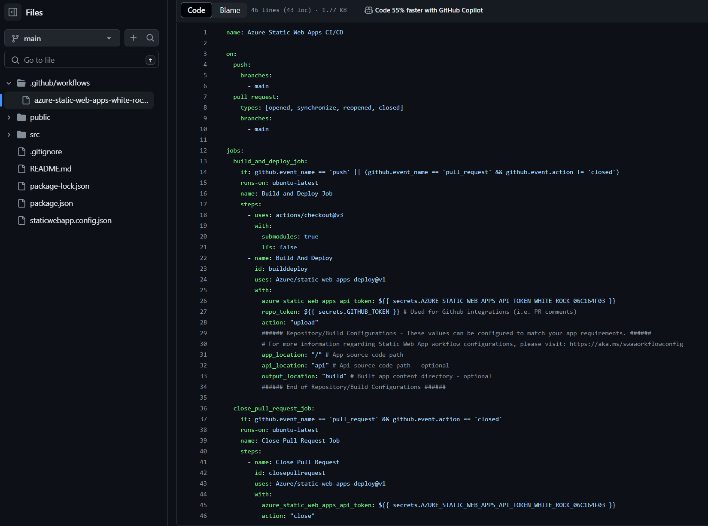
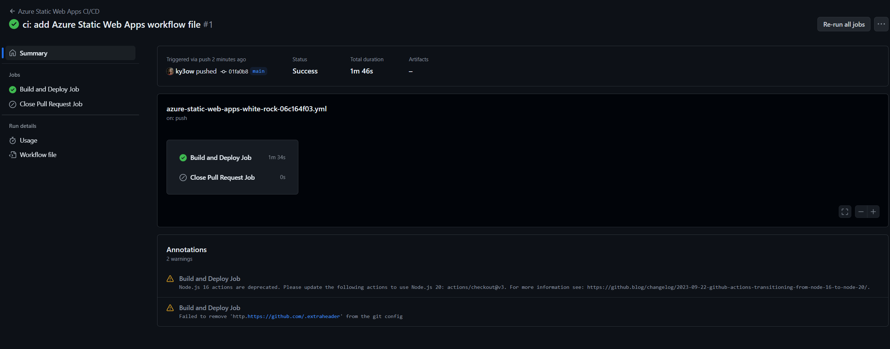
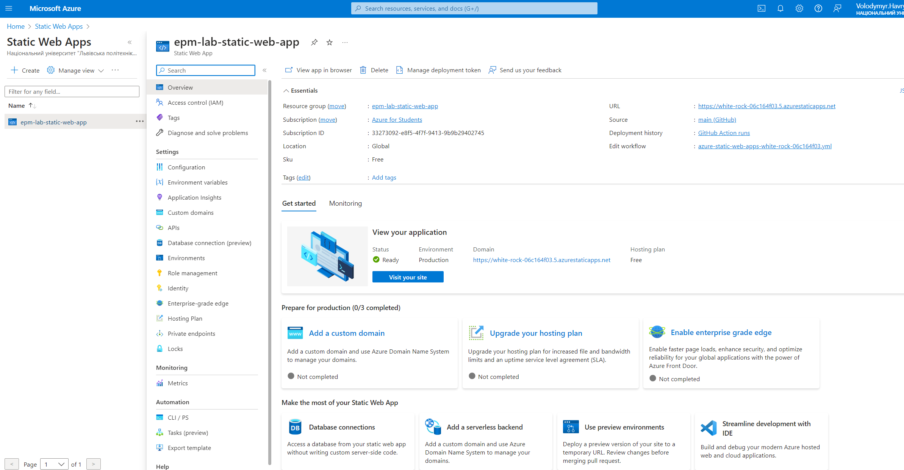

# EPAM Azure Fundamentals Task

This is repo for azure fundamentals task which is part of **Cloud & DevOps Fundamentals Assessment**

## Steps

- Created git [repository](https://github.com/ky3ow/epm-lab-static-web-app) on github
- Cloned repository via `git@github.com:ky3ow/epm-lab-static-web-app.git` onto my local machine
- Opened VSCode and installed **Azure Static Web Apps extension**
- Signed in to Azure from VSCode
- Opened command palette(`Ctrl+Shift+P`) and chose `Create Static Web App`, and populated following prompts

- Static web app resource is generated in Azure, `.github/workflows` automatically generated in repository

- Installed `Azure functions` extension
- Opened command palette and chose `Create HTTP function`
    - created function named `message`
    - modified `api/message/index.js`
    - modified `src/App.js`
    - pulled changes from github, pushed new changes